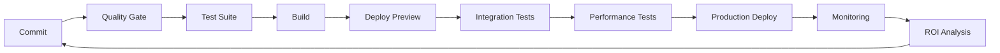

# CI/CD Workflow: ROI-Optimized Pipeline

This document describes our CI/CD pipeline designed to maximize development ROI through automated quality checks, prioritized error resolution, and systematic deployment processes.

## Pipeline Overview



## Stages and ROI Focus

### 1. Quality Gate (Error Convergence)

- **Static Analysis**: Catch issues before they reach testing
- **ROI Priority**: Fail fast on critical issues (security, type errors)
- **Implementation**: GitHub Actions workflow `.github/workflows/code-quality-retrospective.yml`

```yaml
# Key quality checks in our workflow
- name: Run ESLint
  run: npx eslint --ext .js,.jsx,.ts,.tsx .

- name: Check TypeScript
  run: npx tsc --noEmit

- name: Generate code quality report
  run: |
    echo "## Code Quality Report" > quality-report.md
    echo "### ESLint Issues" >> quality-report.md
    npx eslint --ext .js,.jsx,.ts,.tsx --format markdown . >> quality-report.md || true
    echo "### TypeScript Errors" >> quality-report.md
    npx tsc --noEmit --pretty >> quality-report.md 2>&1 || true
```

### 2. Test Suite

- **Unit & Integration Tests**: Verify functionality works as expected
- **ROI Priority**: Run critical path tests first, fail fast
- **Coverage Enforcement**: Per test-coverage-strategy.md

### 3. Build Process

- **Optimization**: Generate production-ready assets
- **ROI Priority**: Measure and enforce bundle size limits
- **Implementation**: Next.js build with performance budgets

### 4. Deploy Preview

- **Branch Previews**: Every PR gets a preview environment
- **ROI Priority**: Enable stakeholder review before merge
- **Implementation**: Vercel integration

### 5. Integration Tests

- **E2E Testing**: Verify critical user flows
- **ROI Priority**: Focus on revenue-generating paths
- **Implementation**: Cypress running against preview environment

### 6. Performance Tests

- **Lighthouse CI**: Measure performance metrics
- **ROI Priority**: Prevent performance regressions
- **Implementation**: GitHub action with budgets

```yaml
- name: Lighthouse CI
  run: |
    npx @lhci/cli@0.9.x autorun
    # Verify performance budgets
```

### 7. Production Deployment

- **Progressive Rollout**: Staged deployment to reduce risk
- **ROI Priority**: Canary releases for early error detection
- **Implementation**: Staged deployment via deployment platform

### 8. Monitoring & Alerts

- **Error Tracking**: Capture runtime errors
- **ROI Priority**: Alert on high-impact issues first
- **Implementation**: Integration with error tracking service

### 9. ROI Analysis

- **Business Metrics**: Track KPIs affected by changes
- **ROI Priority**: Measure actual impact vs. estimated
- **Implementation**: Dashboard of business & technical metrics

## Failure Handling Strategy

| Stage | Failure Type | Action | Justification |
|-------|--------------|--------|---------------|
| Quality Gate | Security | Block deployment | Highest ROI security issue prevention |
| Quality Gate | TypeScript | Block deployment | Highest ROI error prevention |
| Quality Gate | Linting | Warning only | Lower ROI style issues |
| Tests | Unit test | Block deployment | High ROI regression prevention |
| Tests | Coverage decrease | Warning only | Focus on critical test quality |
| Performance | Critical threshold | Block deployment | Prevent user experience degradation |
| Performance | Warning threshold | Notify team | Address in next iteration |
| Production | Error spike | Auto-rollback | Minimize impact duration |

## Optimization Focus

1. **Pipeline Speed**: Fast feedback is critical for developer productivity
   - Parallelize independent steps
   - Cache dependencies and build artifacts
   - Run most likely-to-fail checks first

2. **Resource Efficiency**: Minimize CI resource costs
   - Cancel redundant workflows on new pushes
   - Optimize test suites to reduce execution time
   - Scale down preview environments after inactivity

3. **Developer Experience**: Provide clear actionable feedback
   - Generate quality reports with fix suggestions
   - Provide direct links to failed tests and previews
   - Integrate feedback into IDE where possible
